# Movie Station

___

## Integrantes :

- Mariela Cerna
- Franshesca Quezada
- Claudia Garibotto
- Yanina Mercado

___

### Misión:

Brindar entretenimiento de alta calida a amantes de peliculas de todo tipo de genero en un solo **CLICK!**

__

### Visión:

Los usuarios podran filtrar sus peliculas  y no solo eso! También estar al tanto de los nuevos estrenos.  

A la vez sentiran que estan en la sala de cine o hasta en el mismo mundo de las pelicula ya que nuestros diseños estan basados para su comodidad.

___

##Día 1:

### Inspiración:

Al Inicializar este proyecto nos hemos inspirado en las siguientes páginas web:

- Netflix:

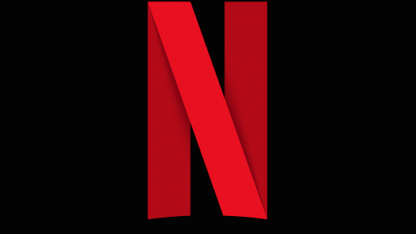

- Popcorn:

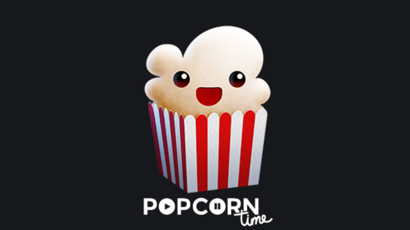

- The Movie Database:

### Nombre del producto:

Hubo varios debates entre los nombres de producto tales como:

- Filmin´ 

- MovieStrip

- Oompa Loompa

- MovieRock

- MovieFriends

- CinemaCatch

- Station: Movie

###Sketch:

1. Splash: Marqueteo de Página web 

2. Vista de logueo:

3. Vista Principal:

4. Vista de Busqueda:

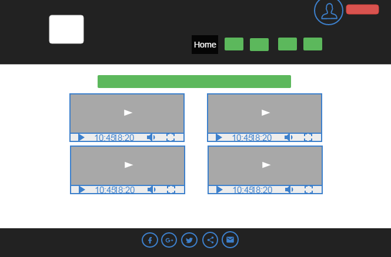

5. Vista de Favoritos:

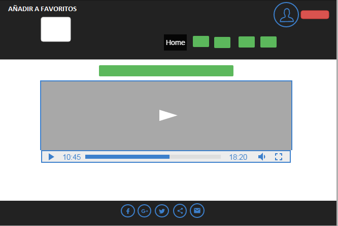

6. Vista de Perfil:

7. Vista de Foro:

___

## Dia 2: 

Se estuvo trabajando en la parte UI-UX con 2 personas del equipo (Franshesca - Mariela) y funcionalidad con el equipo restante (Yanina - Claudia).  

Aunque se estuvo tabajando en la parte de UX-UI desde el Día 1, se pudo terminar las vistas principales para el día 2:

- Splash:

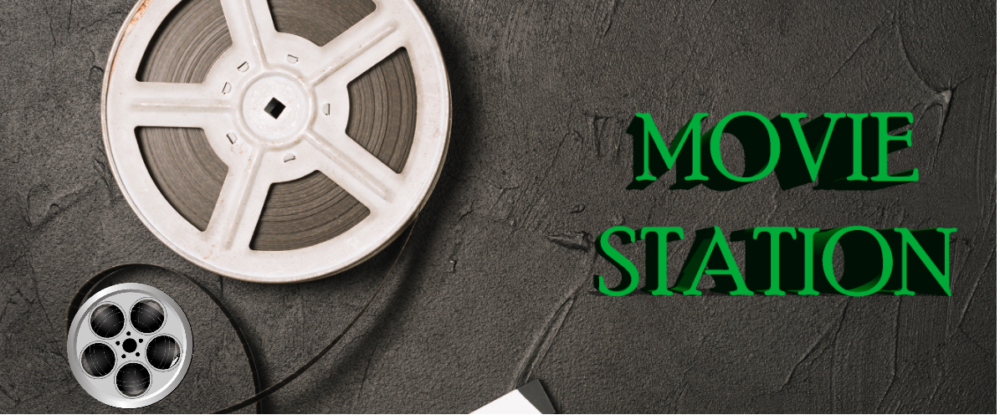

- Página Principal:

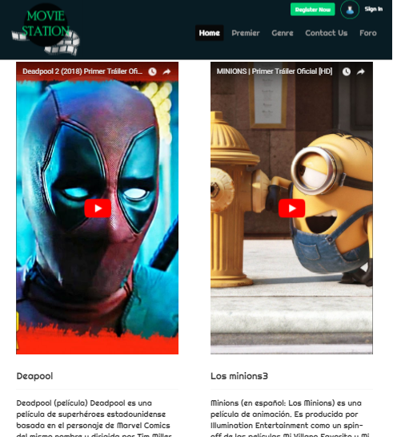

- Página de registro :

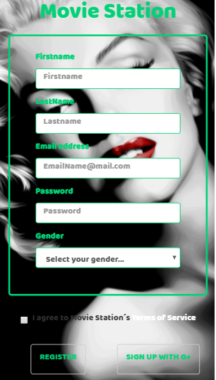

- Página de logueo:

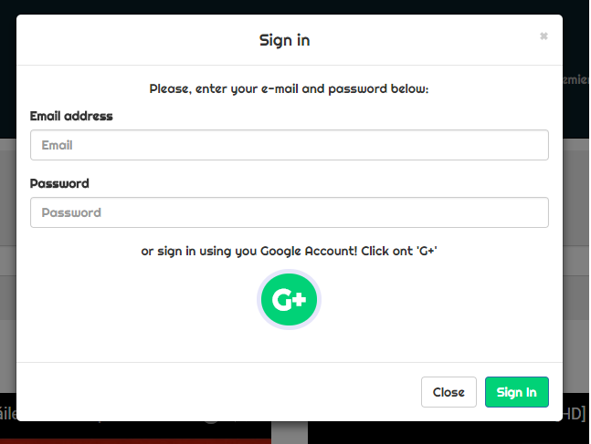

- Página de Favoritos:

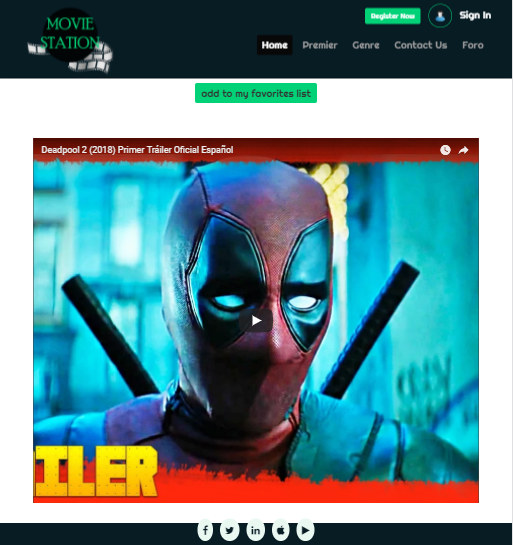

- Página de Perfil Personal:

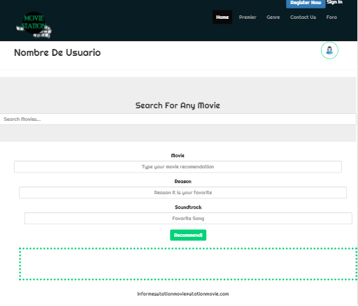

- Forum/chats:

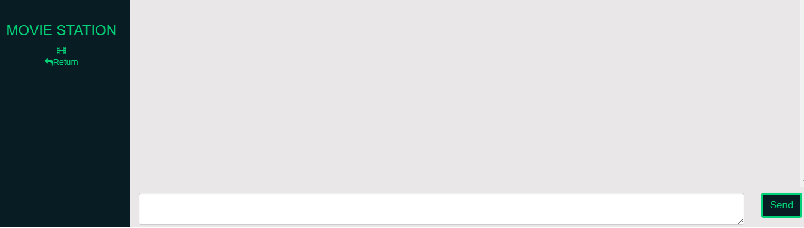

___

## Día 3:

Terminado las vistas se esta añadiendo las funcionalidades para su buen uso y actualización de ReadMe con las ultima innovaciones.

